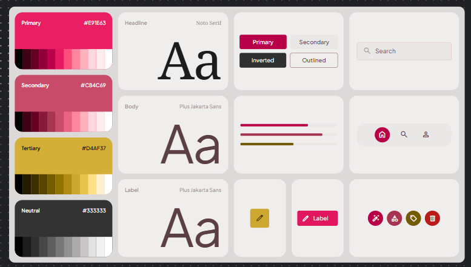

# Parlour Website

A modern and elegant Beauty Parlour Website designed for showcasing makeup services like Bridal, Engagement, and Party makeup.
This project focuses on clean UI, smooth user experience, and a professional online presence for a salon business.

## Features

#### 🏠 Home page with hero section and highlights
#### 💄 Services page with detailed pricing packages
#### 👩‍🎨 About page introducing the makeup artist
#### 📞 Contact page with form and location details
#### 📲 WhatsApp integration for quick booking
#### ⭐ Testimonials section

## TechStack

- Frontend: React.js
- Styling: Tailwind CSS
- Routing: React Router
- Icons: React Icons

## Colour palette

## Getting Started

* <1>  clone the repository
  - 

